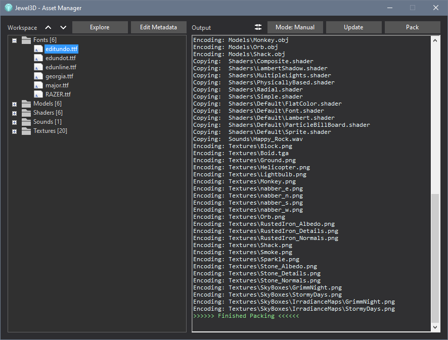

# AssetManager

This tool allows you to easily prepare your assets for run-time use by the framework.

# Workspace
The workspace folder holds all the raw assets that will eventually be used by the game.

# Encoders
An Encoder is a DLL that implements the interface provided by `Jewel3D\Resource\Encoder.h`.
In the AssetManager, each Encoder is associated with a specific file extension. Assets of that type will be processed using the functions in the Encoder.
Custom Encoders can be created for game-specific assets (levels, items, dialog-trees etc.), allowing you to easily pack game data.

# Metadata
Every asset with an associated encoder has metaData created for it. MetaData is saved adjacent to the asset (`assetName.extension.meta`) as plain text.
The content of the metaData file depends on the encoder. These are the properties used when packing the asset into a binary format.
For instance, .ttf.meta files for fonts specify the output resolution of the generated textures.

MetaData files are automatically added for newly created assets while the AssetManager is running.

# Building Assets
The AssetManager provides two functions, Updating and Packing. Updating your workspace will ensure that all	
assets have up-to-date metaData associated with them. If an asset doesn't have metaData, Updating the workspace	
will use the Encoder associated with that asset to generate a default metaData file. If an asset already has	
metaData, the Encoder will be used to validate the integrity of the metaData and update it to the latest version.

Packing the workspace will prepare all assets for use by the game. By default, an output folder called `Assets` will be created adjacent to the Workspace.
All assets with an associated Encoder will be converted using the DLL and saved to the Assets folder. Any remaining assets are copied 1:1 to the folder.
The output folder is populated with the same folder structure as the workspace.

In the default `Manual` packing mode, all assets will be processed when a packing operation is started.
When the mode is set to `Auto`, individual assets will automatically be packed whenever a change is detected on the disk.